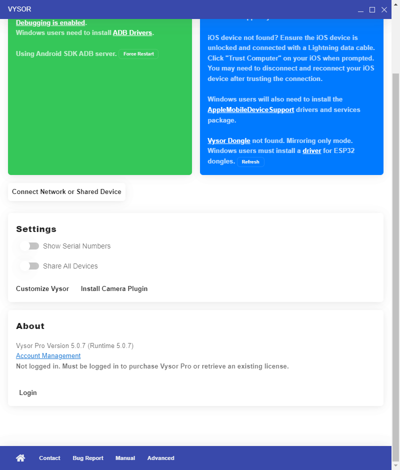

# vysor-pro-patch

One-click patcher for **Vysor 5.0.7** (Windows) that unlocks the Pro features
(higher video bitrate, full resolution, Pro-only toggles) by patching the
local `app.asar` bundle. No license, no login, no network calls to the
billing servers — the renderer is just told it is already licensed.



After running the installer the **About** card reads
`Vysor Pro Version 5.0.7 (Runtime 5.0.7)` and the bitrate slider goes all
the way up to 16 Mbps without the *"Upgrade to Vysor Pro for higher video
bitrates"* upsell.

## What it does

| File | Patch |
|---|---|
| `dist_electron/bundled/main/background.js` | `if (require('process').env.USE_OFFLINE)` → `if (true)` so the renderer is loaded from the local `app://` protocol instead of `https://electron.vysor.io`. Without this, all renderer-side patches are silently ignored because Vysor pulls a fresh, unmodified bundle from the remote URL. |
| `js/app.1f260ea3.js` | Initial license observable starts as `{isLicensed:!0, fromCache:!0, source:{...}}` instead of `{isLicensed:!1, ...}`. |
| `js/app.1f260ea3.js` | Both license-check `catch` blocks (cache + server) keep `isLicensed:!0` instead of falling back to `!1`. |
| `js/app.1f260ea3.js` | The logout / "remove license" path stops resetting `isLicensed` to `!1`. |
| `js/app.1f260ea3.js` | `sendBitrate()` uses `t = 16e6` (the Pro cap) unconditionally, dropping the `licenseInfo.isLicensed ? 16e6 : 1e6` ternary. |
| `js/app.1f260ea3.js` | `sendResolution()` uses `e = 1` unconditionally, dropping the `? 1 : 0` ternary. |
| `js/app.1f260ea3.js` | The two `deviceSettings.bitrate` / `deviceSettings.resolution` watchers no longer clamp values or pop the `Upgrade to Vysor Pro …` upsell. |
| `js/app.1f260ea3.js` | Every read of `e.licenseInfo.isLicensed` and `this.licenseInfo.isLicensed` is rewritten to the literal `!0`, so even sub-components with their own `licenseInfo` instance render as Pro. |
| `index.html` | The `sha256` / `sha384` Subresource-Integrity hashes for `app.1f260ea3.js` are recomputed so Chromium does not refuse to execute the modified bundle. |

The original `app.asar` is saved next to the live one as `app.asar.bak`,
so the install step is fully reversible.

## Supported version

Tested against **Vysor 5.0.7** (the Squirrel build that lives at
`%LOCALAPPDATA%\vysor\app-5.0.7\resources\app.asar`).
Other 5.x builds will probably need the patcher source under `src/`
(see [Building for another version](#building-for-another-version)).

## Install (one command)

Open **PowerShell** (no admin needed) and run:

```powershell
iwr https://raw.githubusercontent.com/kloduss/vysor-pro-patch/main/install.ps1 -UseBasicParsing | iex
```

That:
1. Stops any running `Vysor.exe`.
2. Backs up the current `app.asar` to `app.asar.bak` (only if no backup exists yet).
3. Downloads the patched `app.asar` from this repo.
4. Wipes the Vysor service-worker / HTTP / V8 caches under
   `%APPDATA%\vysor\` so the renderer has to re-load the patched bundle
   from disk on the next launch.

Or, if you cloned the repo, just double-click `install.bat`.

## Uninstall

```powershell
iwr https://raw.githubusercontent.com/kloduss/vysor-pro-patch/main/uninstall.ps1 -UseBasicParsing | iex
```

Or double-click `uninstall.bat` from a clone. The script restores
`app.asar.bak` over `app.asar` and clears the same caches.

## Building for another version

```powershell
# requires Python 3 and Node.js (for the @electron/asar tool)
git clone https://github.com/kloduss/vysor-pro-patch.git
cd vysor-pro-patch\src
python patch.py
```

`src/patch.py` extracts the live `app.asar`, applies the patches, recomputes
SRI hashes and repacks. Adjust the file names at the top of the script
(e.g. `app.1f260ea3.js`) if the target Vysor build ships a different bundle
hash.

## Disclaimer

For personal / educational use. If you actually rely on Vysor day-to-day,
buy a license from the developer at <https://vysor.io>.
